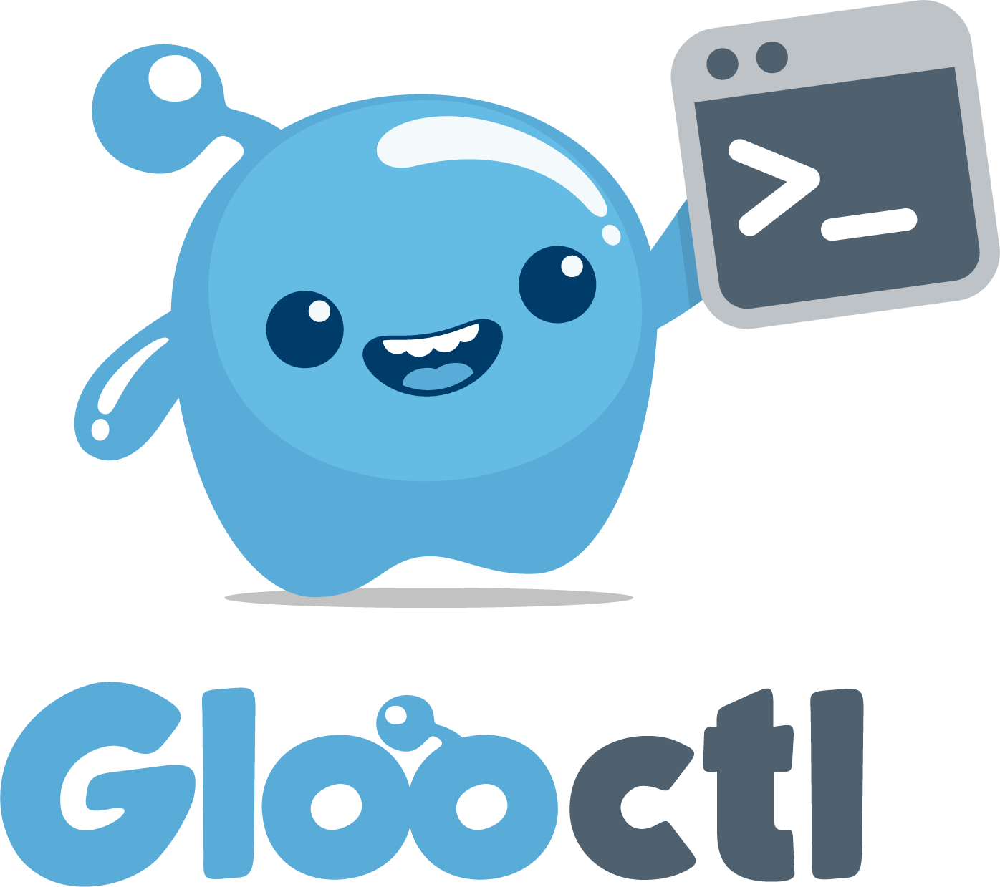

<h1 align="center">
    
  <br>
</h1>

<BR>

Gloo’s command line was designed with ease of user experience for the powerful Gloo config language


## Introduction
`glooctl` is command line tool to manage Gloo resources.

## Getting Started
Download the latest release of `glooctl` from https://github.com/solo-io/glooctl/releases/latest/

If you prefer to compile your own binary please use the following command:

```
go get -u github.com/solo-io/glooctl
```

All `glooctl` commands take `kubeconfig` and `namespace` parameters. If these are not provided,
they default to `~/.kube/config` and `gloo-system` respectively.

### Map a Route to a Function

Let's start by taking an example where we map a path `/calculator` to an AWS Lambda function `calc`

First, we need to store the credentials necessary to access AWS Lambda in a secret. We can do this using `secret` command in `glooctl`

```
glooctl secret create aws --name aws-secret
```

This command creates a secret named `aws-secret` using the credentials stored in `~/.aws/credentials` file. If we want to use a different file we can pass it using `--filename` flag. Alternatively, we can use the standard AWS environment variables to create the by using the `--env` flag.

Next, we represent the AWS Lambda using an upstream. We can create the upstream with the command:

```
glooctl upstream create -f upstream.yaml 
Upstream created
```

The upstream is defined in the `upstream.yaml` file as shown below:

```
# upstream.yaml
name: aws_lambda
type: aws
spec:
  region: us-east-1
  secret_ref: aws-secret
```

`aws-secret` represents the secret we just created. In the above example, we didn't create the function `calc`. Instead we are going to reply to "Gloo Function Discovery" service to automatically discover all the functions.

Now, we can map the path `/calculator` to AWS Lambda `calc` using the command:

```
glooctl route create --path-exact /calculator --upstream aws_lambda --function calc

Using virtual service:  default
path prefix : /calculator
 -> aws_lambda/calc
```

This route tells Gloo to map requests to `/calculator` to the function `calc` in the
upstream `aws_lambda`.


## Managing Routes on a Virtual Service
The `route` command allows us to manage the routes on a specific
virtual service. It uses the default virtual service if we don't specify any virtual service. We can override this by using the `virtual-service` or `v` flag on route commands.

We can also use the `domain` or `d` command to specify the virtual service to use. It selects the virtual service containing that domain.

### Getting Routes
The `get` command returns a list of routes on the virtual service.

```
glooctl route get -v my-virtual-service

request exact path: /bar
request path prefix: /foo
event matcher: /apple
```

By default, `get` returns a summary list. We can pass the `output`
flag to see response in YAML or JSON to get details of the routes.

```
glooctl route get -v my-virtual-service -o yaml

extensions:
  auth:
    credentials:
      Password: bob
      Username: alice
    token: my-12345
request_matcher:
  path_exact: /bar
  verbs:
  - GET
  - POST
single_destination:
  upstream:
    name: my-upstream

extensions:
  auth:
    credentials:
      Password: bob
      Username: alice
    token: my-12345
request_matcher:
  headers:
    x-foo-bar: ""
  path_prefix: /foo
  verbs:
  - GET
  - POST
single_destination:
  function:
    function_name: foo
    upstream_name: aws

event_matcher:
  event_type: /apple
extensions:
  auth:
    credentials:
      Password: bob
      Username: alice
    token: my-12345
single_destination:
  function:
    function_name: foo
    upstream_name: aws
```

### Deleting a Route

```
glooctl route delete -v my-virtual-service --path-prefix /foo

request exact path: /bar
event matcher: /apple
```
### Adding a new Route
In getting started, we saw an example of how to create a route.


Beside using command line flags, we can use a file to define a route that we want to create and pass it to `glooctl` This allows us to specify some of the options that aren't available via CLI flags.

For example, the route given below is created using the route defined in route.yaml.

```
# route.yaml - sample route
request_matcher:
  path_prefix: /foo/bar
  verbs:
  - GET
  - POST
single_destination:
    upstream:
      name: upstream2
```

```
glooctl route create -v my-virtual-service -f route.yaml 
request exact path: /bar
event matcher: /apple
request path prefix: /foo/bar
```

When the route is successfully created it shows the list of existing routes on the virtual service. The newly created route is appended to the end of the list. If we prefer to sort the routes when creating it, we can pass `--sort` flag. 

We could have created this same route passing the following parameters to `glooctl`

```
./glooctl route create -v my-virtual-service --path-prefix /foo/bar --http-method GET,POST --upstream upstream2
```

### Sorting Routes
Sorting routes arranges them based on the matcher. Routes matchers that are specific come before other matchers.

Routes are sorted in order of event, exact path, regex path and path prefix.

```
glooctl route sort -v my-virtual-service  
event matcher: /apple
request exact path: /bar
request path prefix: /foo/bar
```


## Managing Upstreams
`glooctl` provides a manual method of managing Upstreams. Gloo provides auto discovery 
service that can create or delete upstreams automatically. It also provides function
discovery service to manage the functions in an Upstream.

### Creating Upstream
The CLI allows us to create an upstream from a YAML file. 

Let's look at an upstream definition in `upstream.yaml`

```
name: aws_lambda
type: aws
spec:
  region: "us-east-2"
  secret_ref: "aws-secret"
```

If we want to see the newly created upstream, we can pass `output` flag.

```
glooctl upstream create -f upstream.yaml --output yaml

Upstream created
metadata:
  namespace: gloo-system
  resource_version: "224352"
name: aws_lambda
spec:
  secret_ref: aws-secret
  region: us-east-2
type: aws
```

### Getting Upstream
By default, `get` command returns a list of upstream names. 

```
glooctl upstream get

aws_lambda
```

We can pass it the `output` flag to return it as JSON or YAML.

```
glooctl upstream get -o json

{"name":"aws_lambda","type":"aws","spec":{"secret_ref":"aws-secret","region":"us-east-2"},"metadata":{"resource_version":"224352","namespace":"gloo-system"}}
```

If we want to get details of a specific Upstream, we can use
`get` command with the name of the upstream. It returns
the result as YAML, but we can use `output` flag to get JSON.

```
glooctl upstream get aws_lambda

metadata:
  namespace: gloo-system
  resource_version: "224352"
name: aws_lambda
spec:
  secret_ref: aws-secret
  region: us-east-2
type: aws
```

### Updating Upstream
Similar to `create` command, `update` command takes the definition of
upstream from a YAML file and replaces the existing upstream with the
one from the file.

```
glooctl upstream update -f upstream2.yaml -o yaml

Upstream updated
metadata:
  namespace: gloo-system
  resource_version: "224867"
name: aws_lambda
spec:
  secret_ref: aws-secret
  region: us-east-1
type: aws
```

### Deleting Upstream
We can delete an existing upstream by giving the name of the
upstream to be deleted to `delete` command.

```
glooctl upstream delete aws_lambda

Upstream aws_lambda deleted
```

## Managing Virtual Services
`glooctl` provides a manual method of managing Virtual Services. 

### Creating Virtual Service
The CLI allows us to create a virtual from a YAML file. 

Let's look at a virtual service definition in `vservice.yaml`

```
name: vservice1
routes:
- request_matcher:
    path_exact: /bar
    verbs:
    - GET
    - POST
  single_destination:
    upstream:
      name: my-upstream
```

If we want to see the newly created virtual, we can pass `output` flag.

```
glooctl virtualservice create -f vservice.yaml --output yaml

Virtual service created  vservice1
metadata:
  namespace: gloo-system
  resource_version: "226902"
name: vservice1
routes:
- request_matcher:
    path_exact: /bar
    verbs:
    - GET
    - POST
  single_destination:
    upstream:
      name: my-upstream
```

### Getting Virtual Service
By default, `get` command returns a list of virtual service names. 

```
glooctl virtualservice get

vservice1
```

We can pass it the `output` flag to return it as JSON or YAML.

```
glooctl virtualservice get -o json

{"name":"vservice1","routes":[{"request_matcher":{"path_exact":"/bar","verbs":["GET","POST"]},"single_destination":{"upstream":{"name":"my-upstream"}}}],"metadata":{"resource_version":"226902","namespace":"gloo-system"}}
```

If we want to get details of a specific Virtual Service, we can use
`get` command with the name of the virtual service. It returns
the result as YAML, but we can use `output` flag to get JSON.

```
glooctl virtualservice get vservice1

metadata:
  namespace: gloo-system
  resource_version: "226902"
name: vservice1
routes:
- request_matcher:
    path_exact: /bar
    verbs:
    - GET
    - POST
  single_destination:
    upstream:
      name: my-upstream
```

### Updating Virtual Service
Similar to `create` command, `update` command takes the definition of
virtual service from a YAML file and replaces the existing virtual service with the
one from the file.

```
glooctl virtualservice update -f vservice2.yaml -o yaml

Virtual service updated
metadata:
  namespace: gloo-system
  resource_version: "228028"
name: vservice1
routes:
- request_matcher:
    path_exact: /bar
    verbs:
    - GET
    - POST
  single_destination:
    upstream:
      name: new-upstream
```

### Deleting Virtual Service
We can delete an existing virtual by giving the name of the
virtual service to be deleted to `delete` command.

```
glooctl virtualservice delete vservice1

Virtual service vservice1 deleted
```

## Reference
To learn more about Upstreams and Virtual Services please refer
to Gloo documentation.
